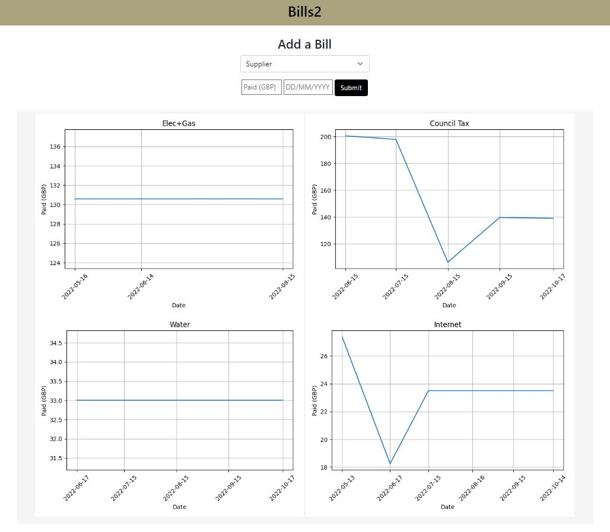
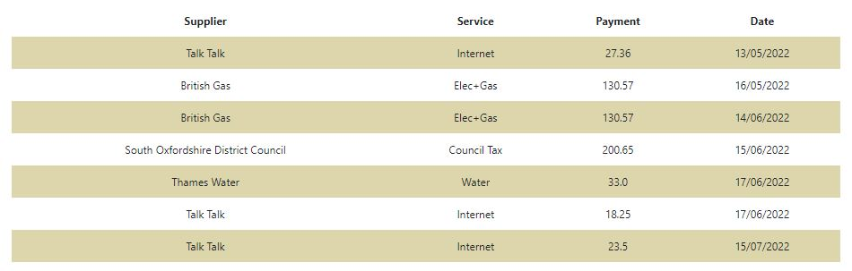

# Bills2
#### **Video Demo**:  https://youtu.be/duYJrDcEG_M
#### **Description**: Web page using Flask (no login required, no user database, for private use only).

The user can add bills payments to a database; the contents of the database are shown on the web page as plots of amount paid vs date, for each supplier, and as a table.

etc.

### Concepts learned during CS50x which I used for this project:
- Python basics
- Databases and SQL
- Web design, web programming using Flask

### New concepts learned while making this project:
- Using venv in Python to install project-specific libraries
- Git: basic operation, not using branching for now (just tried it to learn a bit)

    Current workflow: work locally, push to remote at the end of the day for backup. I find it easier/quicker to 'branch' manually (i.e. no git) and test small variations, then scrap it and replace with backup file if not working out.

    Git commands learned: `git branch -a` / `git checkout main` / `git pull` / `git branch -M main` / `git status` / `git init` / `git remote add origin URL` / (new repository on git created manually) / `git add FILENAME` / `git rm --cached FILENAME` / `git commit -a` / `git push -u origin main`

    I did not like Git for Windows; also tried VS remote repositories but I prefer to work locally (if not important work and can just manually push to Git for backing up).

- using Python `datetime` module (basic, string to timestamp conversion)
- making plots with `matplotlib` module and showing them on a web page using  Flask (followed [this tutorial](https://medium.com/@rovai/from-data-to-graph-a-web-jorney-with-flask-and-sqlite-6c2ec9c0ad0) by M. Rovai).
- using Markdown (to produce this README file).

## Files summary
### static/styles.css:
    CSS style settings
### templates/index.html:
    Simple web page, using Bootstrap 5 for formatting:
    - the supplier is selected from a drop-down list (using a Jinja for loop); the suppliers   are hard coded
    - the amount paid and the date must be entered following the format shown as placeholder
    - clicking the Submit button sends the data (via POST) to app.py where it is added to the database bills.db
### app.py:
    Routing, database access, plot generation (Matplotlib)
### bills.db:
    Database to store paid bills:
    - CREATE TABLE sqlite_sequence(name,seq);
    - CREATE TABLE bills (
    trans_id INTEGER PRIMARY KEY AUTOINCREMENT NOT NULL,
    supplier TEXT NOT NULL, service TEXT NOT NULL,
    payment REAL NOT NULL,
    date DATETIME DEFAULT CURRENT_TIMESTAMP);
### Other files and folders:
    Screenshots of the webpage (.JPG)
    README.md (this file)
    requirements.txt
    /__pychache__
    /bills2_venv
    .gitignore (set to ignore the venv folder)

### **Possible improvements**:

Dates in the database are strings currently, they should be timestamps.

Ability to add or remove suppliers for each of the services.

Error checking on amount paid and date submitted. General debugging and more error checking.

Kept to single page for simplicity but could have one plot/page with stats etc. (for more interesting data maybe)

