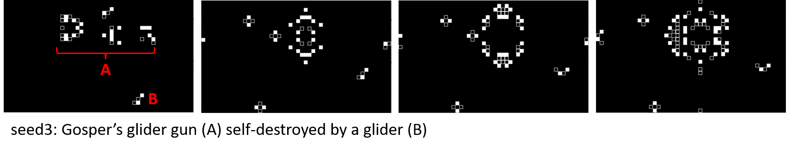
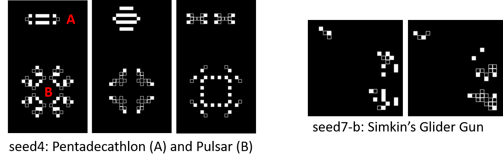
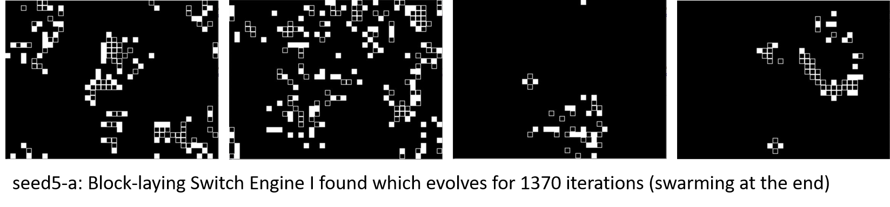
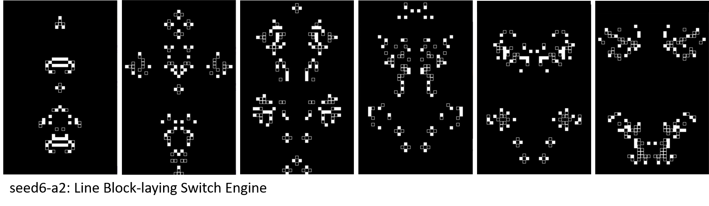
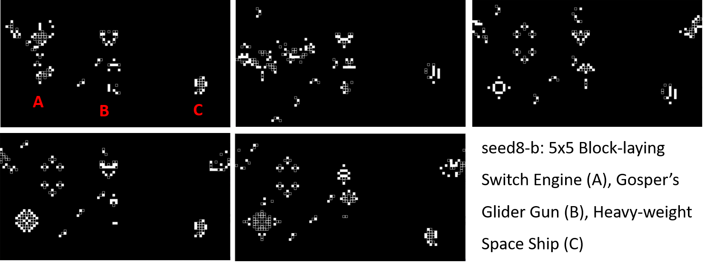

# Life (Conways' Game of Life)
#### **Video Demo**: https://youtu.be/TjpL9sNr2UQ
#### **Description**:
Code I have written to implement Conway's Game of Life (B3/S23 rule). The game, also known as Life, is a zero-player game based on a cellular automaton invented by the British mathematician John Horton Conway in 1970. Being zero-player, it is played by deciding an initial state for the system and watching it evolve based on selection rules for which cells are born, survive, or die, in the next iteration.
Here's a link to the Wikipedia page for more information: https://en.wikipedia.org/wiki/Conway%27s_Game_of_Life

Submitted as final project for CS50P 2023, Introduction to programming with Python.
Note: I tried to get rid of the 'bubbling' effect by only updating for live cells but it is not that, still trying to figure out why it looks like that, but I quite like it.

Some screenshots of what I tried so far:

### New concepts I learned for this project:
- Cyclical arrays, shallow and deep copying
- Pygame display

### Seed arrays tried:
    NAME	TYPE	                    SIZE	~LIFESPAN
    seed1	blinker             	    4x6     -
    seed2	2 gliders, 2 blinkers	    30x50	170
    seed3	Gosper's GG		50x30	    720
    seed4	Pulsar, Pentadecathlon	    30x50	-
    seed4-a	(added a glider)	        "	    90
    seed4-b (added a LWSS)		        "	    90
    seed4-c (added a 2nd LWSS)	        "	    90
    seed4-c2 (replaced a LWSS with a MWSS)	"	1150
    seed5	BLSE wrongly draw (1)	    40x30	30
    seed5-a	2 BLSE wrongly drawn (1)	40x30	1370	
    seed5-b 1 BLSE wrongly drawn (2)	40x30	20
    seed5-c correct BLSE (IG)	        40x30	780
    seed6	BLSE (single row)	        50x30	250
    seed6-a	BLSE (single row)	        34x60	110
    seed6-a2	BLSE (single row)	    35x56	200
    seed6-a3	3 BLSE (single row)	    35x56	390
    seed6-a4	BLSE (single row)	    35x60	240
    seed6-a5	BLSE (single row)	    34x60	100
    seed7-a Simkin's GG (wrong)	        40x30	1360
    seed7-b	Simkin's GG		            90x50	1560
    seed8	BLSE-5x5	                90x50	1100
    seed8-a	BLSE-5x5 + HWSS	            90x50	1050
    seed8-b BLSE-5x5 + HWSS + Gosper-GG	90x50	850

## Files summary
### life-game_fg3.py (project.py):
    main code
### test_life-game.py (test_project.py):
    tests for some of the functions in main code, to run with Pytest
### seed(number)-(letter).csv:
    comma-separated 2D arrays to use as initial states
### Other files and folders:
    Screenshots of the game (.png)
    README.md (this file)
    requirements.txt

